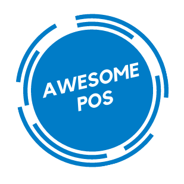

  

<h3 align="center">Awesome POS</h3>

---

 

 Awesome POS is a Point of Sale System that supports a 2d barcode scanner.
      

 

## 🧐 About

Awesome POS is a Point of Sale System that supports a barcode scanner. 
The idea came up when I noticed how hardware-dependent the usual point of sale systems are. 
We are living in a cloud computing world, so why we cannot use any device as a point of sale system, why we cannot use a cross-platform solution? 
With these questions in mind, I decided to give it a try and create a point of sale system completely in a web environment with 2d barcode scanner support.

 

## 🎈 Demo

[Demo page](https://awesomepos.netlify.app/) deployed on Netlify (frontend) and Heroku (backend).

Demo Accounts: 
Admin: 
Email: admin-login@gmail.com 
Password: 12345678 
 
Cashier: 
Email: cashier-login@gmail.com 
Password: 87654321

 

## 🎈 Usage

- After login, the user will be redirected to the Transaction page. 
- The user can switch between the use of the barcode scanner or product icons to add products on the checkout. 
- Every product is related to a product category ( for example, the product “Coca Cola Zero” is related to the product category “Soft Drinks”). 
- The user can set a discount % and discount expiration thru the date picker, on a product category, or/and in a product individually. On checkout, the product discount has a higher order than a product category discount. 
- Example of a product category and product discount combination: 
  If “Coca Cola Zero” has an active discount of 10% and at the same time the product category of “Soft Drinks” has an active discount of 5%, the checkout calculates for “Coca Cola Zero” 10% discount. All the other soft drinks that will be added to the checkout would be calculated with the 5% product category discount. 
- The user registration is only possible from an admin. Only the admin can create other admins or cashiers. The admin can delete cashier accounts but not admins. An admin can delete their account but only if is not the last admin on the database.

 

## ⛏️ Built Using

- [MongoDB](https://www.mongodb.com/) - Database
- [Express](https://expressjs.com/) - Server Framework
- [VueJs](https://reactjs.org/) - Web Framework
- [NodeJs](https://nodejs.org/en/) - Server Environment

 

## ✍️ Authors

- [@stavros-temertzidis](https://github.com/stavros-temertzidis) - Idea & Initial work
